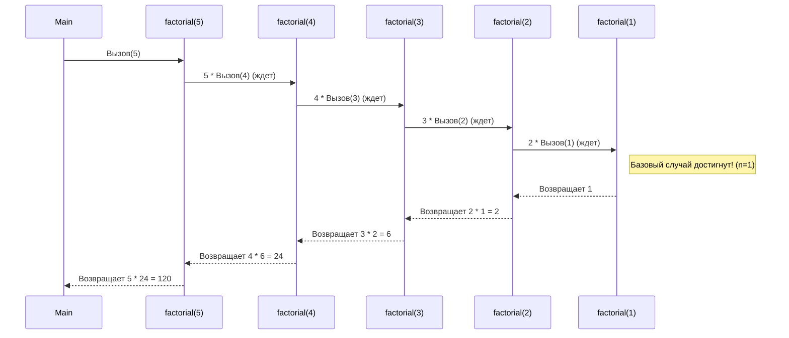

Продолжаем наш курс. Сегодня мы разберем одну из самых красивых, но поначалу взрывающих мозг концепций в программировании. Мы поговорим о рекурсии.

---

## Час 6: Рекурсия. Погружение и возвращение

Рекурсия — это когда функция вызывает саму себя. Звучит как рецепт для бесконечного цикла, и если написать её неправильно, именно это и произойдет (знаменитая ошибка `StackOverflowError`).

Чтобы понять рекурсию, нужно усвоить два её главных правила, два столпа, на которых она держится:
1. **Базовый случай (Условие выхода):** Момент, когда функция говорит: «Всё, я дошла до дна, пора возвращаться». Без него вы убьете программу.
2. **Рекурсивный шаг:** Логика, которая приближает нас к базовому случаю на каждом новом вызове.

### 1. Классика: Факториал и Стек вызовов

Самый простой пример — вычисление факториала числа (например, $5! = 5 \times 4 \times 3 \times 2 \times 1$).

**Kotlin Notebook Example:**
```kotlin
fun factorial(n: Int): Int {
    // 1. Базовый случай: факториал 1 равен 1. Пора останавливаться.
    if (n == 1) return 1 
    
    // 2. Рекурсивный шаг: умножаем текущее число на факториал числа (n - 1)
    return n * factorial(n - 1)
}

println("Факториал 5: " + factorial(5)) // Используем конкатенацию для вывода
```

**Что происходит под капотом? (Понимание Стека)**
Компьютер не может сразу умножить `5 * factorial(4)`, потому что он не знает, чему равен `factorial(4)`. Он ставит вычисления "на паузу" и складывает их в стопку (Стек вызовов).

Как только мы достигаем базового случая (`n = 1`), стопка начинает разворачиваться обратно:



---

### 2. Практический пример: RPG-сценарий и поиск лута

Сухие математические функции — это хорошо, но давайте посмотрим, где рекурсия действительно сияет. Зачастую это структуры данных, где глубина вложенности неизвестна (например, деревья, которые мы обсуждали ранее).

Представьте классический RPG-квест. Герой находит в подземелье огромный зачарованный сундук. Он открывает его, а внутри — золото и... еще сундуки. А внутри тех сундуков — еще золото и сундуки поменьше. Обычным циклом `for` или `while` мы замучаемся отслеживать все вложенности. Рекурсия решает это элегантно.

**Kotlin Notebook: Инвентарь**
```kotlin
// Описываем базовый класс для предметов
abstract class Item

// Золото - это просто предмет с количеством монет
class Gold(val amount: Int) : Item()

// Сундук - это предмет, который содержит список других предметов
class Chest(val contents: List<Item>) : Item()

// Наша рекурсивная функция подсчета всего золота
fun countTotalGold(item: Item): Int {
    return when (item) {
        // Базовый случай: если это просто золото, возвращаем его количество
        is Gold -> item.amount 
        
        // Рекурсивный шаг: если это сундук, пробегаемся по всему, что внутри,
        // и для каждого предмета снова вызываем countTotalGold
        is Chest -> {
            var sum = 0
            for (innerItem in item.contents) {
                sum += countTotalGold(innerItem)
            }
            sum
        }
        else -> 0
    }
}

// Создаем "подземелье"
val hiddenStash = Chest(listOf(Gold(50), Gold(20)))
val mainChest = Chest(listOf(
    Gold(100),
    Chest(listOf(Gold(300))), // Сундук в сундуке
    hiddenStash               // Еще один вложенный сундук
))

println("Всего золота найдено: " + countTotalGold(mainChest)) 
```
*Заметка преподавателя: Здесь рекурсия позволяет нам вообще не думать о том, насколько глубоко спрятаны предметы. Функция сама «ныряет» до самого дна каждого сундука.*

---

### 3. Опасность рекурсии и магия `tailrec` в Kotlin

Главный минус рекурсии — **расход памяти**. Каждый вызов функции отнимает кусочек оперативной памяти под стек. Если глубина погружения будет слишком большой (например, 100 000 сундуков друг в друге), программа упадет с ошибкой памяти.

Но Kotlin — умный язык. В нем есть ключевое слово `tailrec` (хвостовая рекурсия).
Если рекурсивный вызов является **самой последней операцией** в функции, компилятор под капотом превратит рекурсию в обычный быстрый цикл `while`. Вы получаете красоту рекурсивного кода и производительность цикла!

```kotlin
// Компилятор оптимизирует этот код, и переполнения стека не будет!
tailrec fun calculateDamageOverTime(ticksLeft: Int, currentDamage: Int = 0): Int {
    if (ticksLeft == 0) return currentDamage // Базовый случай
    
    // Рекурсивный вызов - это строго последняя операция
    return calculateDamageOverTime(ticksLeft - 1, currentDamage + 15)
}

println("Урон от яда за 10000 тиков: " + calculateDamageOverTime(10000))
```

### Подведем итоги:
1. **Рекурсия** — это функция, вызывающая саму себя.
2. Всегда начинайте написание рекурсии с **базового случая**, иначе программа уйдет в бесконечность.
3. Рекурсия идеальна для обхода графов, деревьев и сложных вложенных структур (как сундуки с лутом).
4. Используйте `tailrec` в Kotlin там, где это возможно, чтобы защитить стек памяти.

**Ваше задание для самостоятельной работы:** Напишите рекурсивную функцию, которая принимает строку и возвращает её задом наперед (например, "Кот" -> "тоК"). *Подсказка: базовый случай — пустая строка.*