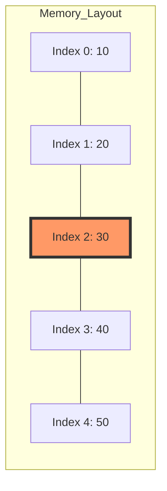
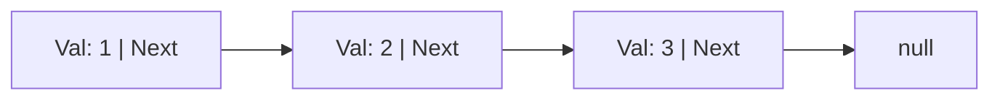
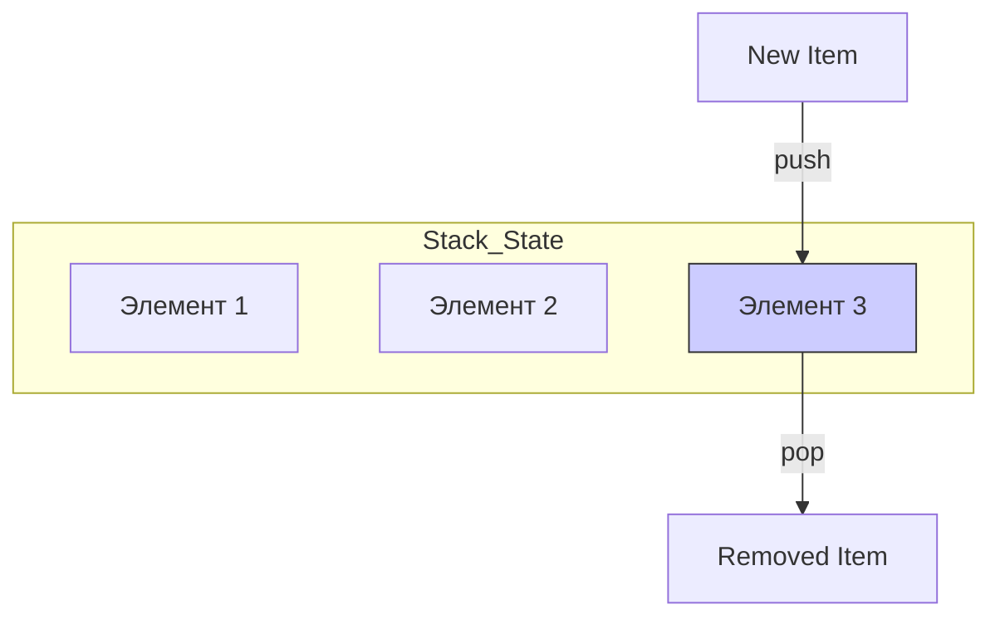
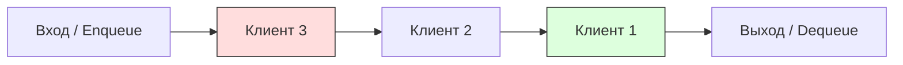

Переходим от абстрактных оценок сложности к конкретным инструментам.

**Линейные структуры данных** — это фундамент. Если вы ошибетесь с выбором структуры на этом этапе, никакая $O$-нотация не спасет ваше приложение от деградации производительности.

Ниже представлено содержание для вашего **Kotlin Notebook**.

---

# Тема 2: Линейные структуры данных
## Массивы, Списки, Стеки и Очереди

На этом занятии мы разберем, как данные располагаются в оперативной памяти и как этот физический фактор влияет на скорость нашего кода.

---

## 1. Массивы (Arrays)
Массив — это непрерывный блок памяти. Все элементы одного типа и лежат строго друг за другом.

**Ключевая особенность:** Зная индекс, мы можем вычислить адрес элемента в памяти за $O(1)$.

```kotlin
// В Kotlin массивы имеют фиксированный размер
val simpleArray = arrayOf(10, 20, 30, 40, 50)

// Доступ по индексу — мгновенно O(1)
println("Элемент под индексом 2: ${simpleArray[2]}")
```

**Визуализация памяти (Mermaid):**

> **Проблема:** Вставка в середину массива требует сдвига всех последующих элементов ($O(n)$).

---

## 2. Связанные списки (Linked Lists)
В отличие от массива, элементы списка (узлы) могут быть разбросаны по всей памяти. Каждый узел знает только свое значение и адрес следующего узла.

**Пример реализации простого узла:**
```kotlin
class Node<T>(val value: T, var next: Node<T>? = null)

fun main() {
    val head = Node(1)
    head.next = Node(2)
    head.next?.next = Node(3)
    
    // Проход по списку O(n)
    var current: Node<Int>? = head
    while (current != null) {
        print("${current.value} -> ")
        current = current.next
    }
    println("null")
}
```

**Структура связного списка (Mermaid):**


---

## 3. Стек (Stack) — Принцип LIFO
**LIFO (Last In, First Out)** — последний зашел, первый вышел. Представьте стопку тарелок. Вы не можете взять нижнюю, не сняв верхние.

**Основные операции:**
- `push`: положить наверх ($O(1)$)
- `pop`: забрать сверху ($O(1)$)

**Реализация на базе MutableList:**
```kotlin
class Stack<T> {
    private val storage = mutableListOf<T>()
    
    fun push(item: T) = storage.add(item)
    fun pop(): T? = if (storage.isNotEmpty()) storage.removeAt(storage.size - 1) else null
    fun peek(): T? = storage.lastOrNull()
}

val stack = Stack<String>()
stack.push("Завтрак")
stack.push("Обед")
println("Снимаем сверху: ${stack.pop()}") // Обед
```

**Механика стека (Mermaid):**


---

## 4. Очередь (Queue) — Принцип FIFO
**FIFO (First In, First Out)** — первый зашел, первый вышел. Как обычная очередь в магазине.

**Основные операции:**
- `enqueue`: встать в конец ($O(1)$)
- `dequeue`: выйти из начала ($O(1)$)

```kotlin
import java.util.ArrayDeque

val queue = ArrayDeque<String>()
queue.add("Клиент 1")
queue.add("Клиент 2")
queue.add("Клиент 3")

println("Обслуживаем: ${queue.poll()}") // Клиент 1
println("Следующий: ${queue.peek()}")    // Клиент 2
```

**Механика очереди (Mermaid):**


---

## Итоговое сравнение структур

| Структура | Доступ | Вставка/Удаление (начало) | Вставка/Удаление (конец) |
| :--- | :--- | :--- | :--- |
| **Массив** | $O(1)$ | $O(n)$ | $O(1)$ |
| **Список** | $O(n)$ | $O(1)$ | $O(n)$* |
| **Стек** | только верхний | - | $O(1)$ |
| **Очередь** | только первый | $O(1)$ | $O(1)$ |

*\*В двусвязном списке со ссылкой на хвост вставка в конец будет O(1).*

---

### Практикум: "Проверка скобок"
Используя изученный сегодня **Стек**, решите классическую задачу:
Дана строка `"{[()]}"`. Проверьте, правильно ли расставлены скобки.

**Подсказка:**
1. Итерируйте строку.
2. Если скобка открывающая — `push` её в стек.
3. Если закрывающая — `pop` из стека и проверьте, совпадает ли тип.
4. Если в конце стек пуст — всё верно!

**Напишем код? Или переходим к Часу 3: Поиску и Хешированию?**