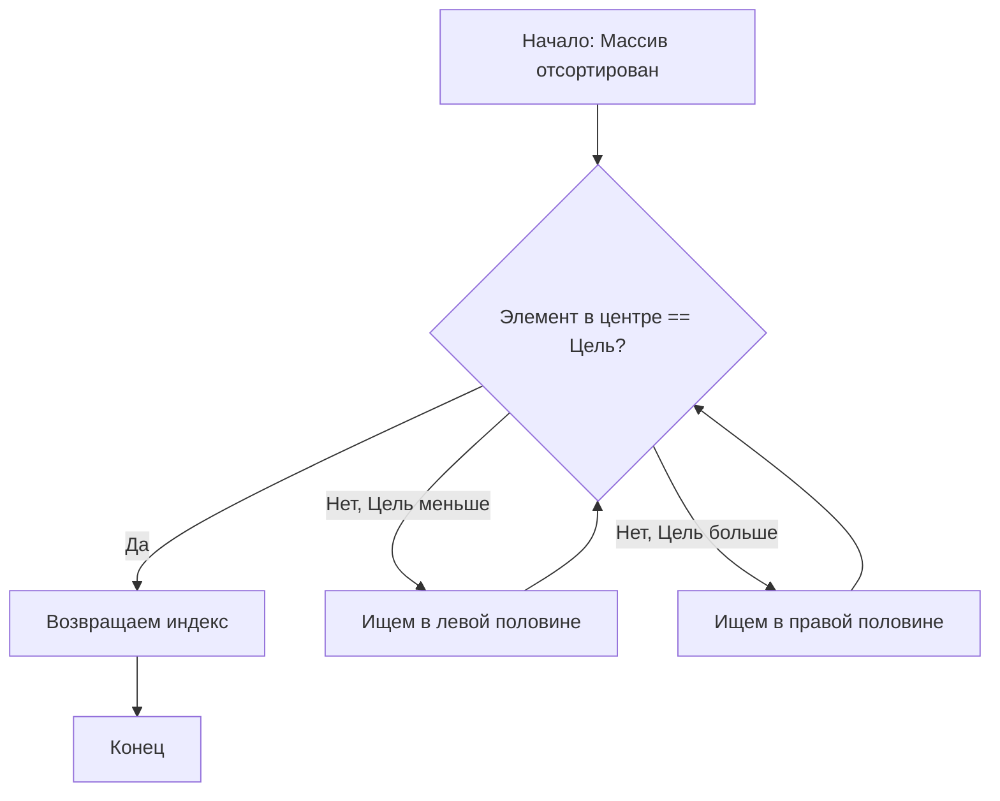
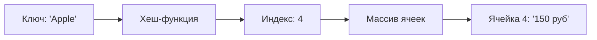

---

## 3: Поиск и Хеш-таблицы. Скорость имеет значение

### 1. Бинарный поиск: Искусство деления пополам

Если ваши данные не упорядочены, у вас нет выбора — придется смотреть каждый элемент ($O(n)$). Но если массив **отсортирован**, мы можем применить стратегию «Разделяй и властвуй».

**Принцип работы:** Мы всегда смотрим в центр. Если искомое больше центра — отбрасываем левую половину. Если меньше — правую.



**Kotlin Notebook Example:**
```kotlin
fun binarySearch(list: List<Int>, target: Int): Int? {
    var low = 0
    var high = list.size - 1

    while (low <= high) {
        val mid = (low + high) / 2
        val guess = list[mid]
        if (guess == target) return mid
        if (guess > target) high = mid - 1 else low = mid + 1
    }
    return null
}

val numbers = listOf(1, 3, 5, 7, 9, 11)
println("Индекс элемента 7: ${binarySearch(numbers, 7)}") // Output: 3
```
*Сложность: $O(\log n)$. Для 1 миллиона элементов нам понадобится максимум 20 проверок.*

---

### 2. Хеш-таблицы: Поиск за $O(1)$

Хеш-таблица (HashMap в Java/Kotlin, Dict в Python) — это структура, которая позволяет находить значение по ключу мгновенно.

**Как это работает:**
1. Берем ключ (например, строку "User123").
2. Пропускаем через **хеш-функцию**, которая превращает его в число (индекс массива).
3. Кладем значение в ячейку под этим индексом.

**Проблема коллизий:**
Иногда два разных ключа дают один и тот же индекс.
* **Метод цепочек:** В ячейке массива хранится не один элемент, а список (LinkedList).
* **Открытая адресация:** Если ячейка занята, ищем следующую свободную.



---
