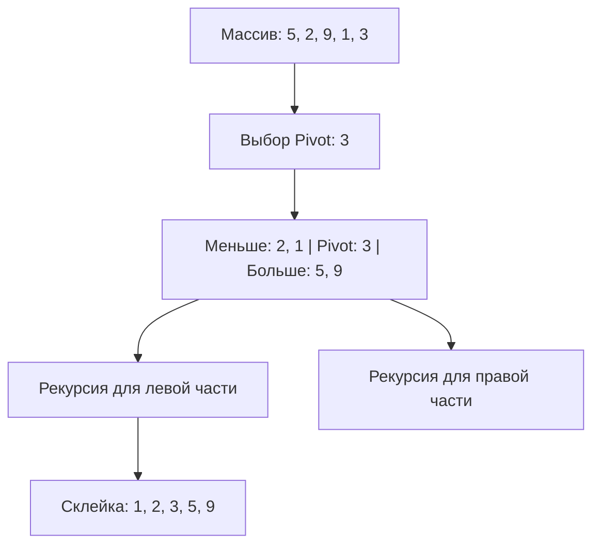

## 4: Алгоритмы сортировки. От простого к сложному

Сортировка — это база для оптимизации. Большинство высокоуровневых функций поиска и обработки данных работают быстрее именно на отсортированных структурах.

### 1. Простые алгоритмы ($O(n^2)$)

Эти алгоритмы интуитивно понятны, но "тяжелы" для больших данных.
* **Сортировка пузырьком:** Самый легкий элемент «всплывает» в конец массива за счет постоянных сравнений соседних пар.
* **Сортировка вставками:** Представьте, что вы сортируете карты в руке. Вы берете новую карту и вставляете её в нужное место среди уже отсортированных.

---

### 2. Эффективные алгоритмы ($O(n \log n)$)

Здесь в игру вступает **рекурсия**.

#### **Quick Sort (Быстрая сортировка)**
Выбираем «опорный» элемент (pivot). Все, что меньше — налево, что больше — направо. Повторяем рекурсивно для обеих половин.



#### **Merge Sort (Сортировка слиянием)**
Разбиваем массив на единичные элементы, а затем сливаем их обратно парами, сразу выстраивая правильный порядок. Это «гарантированная» скорость $O(n \log n)$, но требует дополнительной памяти.

**Заметка преподавателя по рекурсии:**
Рекурсия — это когда функция вызывает саму себя. Чтобы не уйти в бесконечный цикл, всегда определяйте **базовый случай** (например, когда в массиве 0 или 1 элемент — он уже отсортирован).

**Kotlin Notebook: Реализация QuickSort:**
```kotlin
fun quicksort(items: List<Int>): List<Int> {
    if (items.count() < 2) return items
    val pivot = items[items.count() / 2]
    val equal = items.filter { it == pivot }
    val less = items.filter { it < pivot }
    val greater = items.filter { it > pivot }
    return quicksort(less) + equal + quicksort(greater)
}

val unsorted = listOf(10, 5, 2, 3, 1, 8)
println("Отсортированный массив: ${quicksort(unsorted)}")
```

---

### Подведем итоги:
1. **Бинарный поиск** — быстрый, но требует порядка.
2. **Хеш-таблицы** — мощный инструмент для мгновенного доступа, если не бояться коллизий.
3. **Сортировка** — разделяется на «ученическую» ($O(n^2)$) и «промышленную» ($O(n \log n)$).

