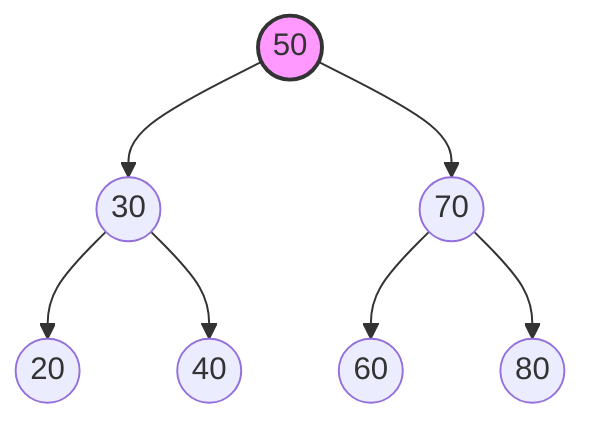
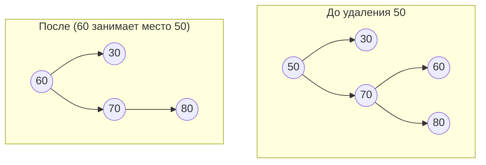

Переходим от линейных структур к многомерным.

---

## Час 5: Деревья и основы Графов

Массивы и списки — это как прямая дорога. Но реальный мир устроен иначе. Социальные сети (кто на кого подписан), маршрутизаторы в интернете, файловая система на вашем компьютере — всё это **графы**.

**Граф** состоит из узлов (вершин) и связей (ребер).
**Дерево** — это частный случай графа. Главное правило дерева: в нём есть строгая иерархия (от корня вниз) и **нет циклов** (нельзя по связям вернуться в ту же точку, откуда начал).

### 1. Бинарное дерево поиска (BST - Binary Search Tree)

Почему бинарное? У каждого узла может быть максимум два "ребенка" (левый и правый).
Почему "поиска"? Потому что оно строится по жесткому правилу, которое делает поиск невероятно быстрым:
> **Правило BST:** Все значения в левом поддереве **меньше** значения узла. Все значения в правом поддереве — **больше**.

Вот как это выглядит визуально:



Если мы ищем число `60`, алгоритм будет таким:
1. Сравниваем `60` с корнем `50`. `60 > 50`, идем направо.
2. Сравниваем `60` с `70`. `60 < 70`, идем налево.
3. Нашли `60`! Мы отбросили половину дерева на каждом шаге. Сложность поиска — $O(\log n)$.

#### Реализация на Kotlin: Структура и Поиск

Сначала создадим базовый кирпичик дерева — узел (`Node`):

```kotlin
class Node(var value: Int) {
    var left: Node? = null
    var right: Node? = null
}

class BinarySearchTree {
    var root: Node? = null

    // Функция поиска
    fun search(value: Int): Node? {
        var current = root
        while (current != null) {
            when {
                value == current.value -> return current // Нашли!
                value < current.value -> current = current.left // Идем налево
                value > current.value -> current = current.right // Идем направо
            }
        }
        return null // Элемент не найден
    }
}
```

---

### 2. Вставка и Удаление в BST

**Вставка** работает точно так же, как поиск. Мы спускаемся по дереву, пока не найдем пустое место (`null`), куда и прикрепляем новый узел.

```kotlin
    // Добавляем метод в класс BinarySearchTree
    fun insert(value: Int) {
        val newNode = Node(value)
        if (root == null) {
            root = newNode
            return
        }

        var current = root!!
        while (true) {
            if (value < current.value) {
                if (current.left == null) {
                    current.left = newNode
                    return
                }
                current = current.left!!
            } else {
                if (current.right == null) {
                    current.right = newNode
                    return
                }
                current = current.right!!
            }
        }
    }
```

**Удаление** — самая хитрая операция. У нас есть 3 сценария (представьте, что мы удаляем начальника из отдела):

1. **Узел — лист (нет детей):** Самое простое. Просто стираем его (например, узел `20` на схеме выше).
2. **Узел имеет одного ребенка:** Ребенок просто "поднимается" на место удаленного родителя.
3. **Узел имеет двух детей:** Самое сложное. Кто займет его место? Мы должны найти **наименьший элемент в правом поддереве** (следующий по старшинству), поставить его на место удаляемого узла, а затем удалить тот наименьший элемент с его старого места.



---

### 3. Обходы (Traversals): Как посетить всех и не заблудиться?

Массив можно просто прочитать циклом `for` от `0` до `n`. А как прочитать дерево? Для этого используют рекурсивные обходы.

#### 1. In-order (Симметричный обход)
*Порядок: Левое поддерево -> Текущий узел -> Правое поддерево.*
**Фишка:** Если применить его к BST, он выведет все элементы в строго отсортированном порядке по возрастанию!

```kotlin
fun inOrder(node: Node?) {
    if (node == null) return
    inOrder(node.left)           // Сначала левые
    print("${node.value} ")      // Затем сам узел
    inOrder(node.right)          // Затем правые
}
// Для нашего первого графа вывод будет: 20 30 40 50 60 70 80
```

#### 2. Pre-order (Прямой обход)
*Порядок: Текущий узел -> Левое поддерево -> Правое поддерево.*
**Фишка:** Отлично подходит для создания копии дерева или сохранения его структуры в файл.

```kotlin
fun preOrder(node: Node?) {
    if (node == null) return
    print("${node.value} ")      // Сначала узел
    preOrder(node.left)          // Затем левые
    preOrder(node.right)         // Затем правые
}
// Вывод: 50 30 20 40 70 60 80
```

#### 3. Post-order (Обратный обход)
*Порядок: Левое поддерево -> Правое поддерево -> Текущий узел.*
**Фишка:** Незаменим при удалении дерева из памяти. Мы сначала удаляем "детей", а только потом — "родителя".

```kotlin
fun postOrder(node: Node?) {
    if (node == null) return
    postOrder(node.left)         // Сначала левые
    postOrder(node.right)        // Затем правые
    print("${node.value} ")      // Узел в конце
}
// Вывод: 20 40 30 60 80 70 50
```

### Резюме лекции
Деревья позволяют совместить плюсы массивов (быстрый доступ по индексу превращается в быстрый бинарный поиск)
и плюсы связных списков (быстрая вставка и удаление без сдвига всех элементов). Понимание того, как спуститься по дереву с помощью рекурсии — это важный рубеж в понимании структур данных.