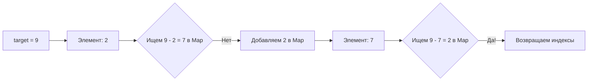

**Ваше задание:** Попробуйте реализовать бинарный поиск для списка строк (например, имен студентов). Помните, что строки в Kotlin сравниваются лексикографически с помощью операторов `>` и `<`.

Коллеги, теория — это компас, но без практики мы никуда не уплывем. Этот час мы проведем в формате "hands-on" (практического интенсива).

Я подготовил для вас структуру тетради Kotlin Notebook. В ней есть описание задач, логические подсказки для тех, кто застрянет, и готовые блоки с тестами (`assert`-блоки), чтобы вы могли мгновенно проверить свой код.

---

## Час 6: Практический интенсив. Пишем код, который работает быстро

### Задача 1: Two Sum (Сумма двух)

**Сюжет:** Вы взламываете замок. Замок откроется, если вы вставите в него два кристалла, суммарная энергия которых равна строго заданной величине $K$. У вас есть массив кристаллов разной энергоемкости. Найдите индексы этих двух кристаллов.

**Дано:** Массив целых чисел `nums` и целое число `target`.
**Задача:** Вернуть индексы двух чисел, которые в сумме дают `target`. Вы можете предполагать, что у каждой задачи есть ровно одно решение, и вы не можете использовать один и тот же элемент дважды.

**Подсказки для студентов:**
1. *Ученический подход ($O(n^2)$):* Запустить вложенный цикл. Берем первый элемент и проверяем его со всеми остальными. Берем второй и проверяем со всеми остальными. Это работает, но на миллионе записей сервер "ляжет".
2. *Инженерный подход ($O(n)$):* Используйте хеш-таблицу (в Kotlin это `HashMap` или просто `mutableMapOf`).
3. Идя по массиву, спросите себя: "Какое число мне нужно, чтобы получить `target`?". Если `target` = 9, а текущее число 2, вам нужна 7.
4. Проверьте, есть ли 7 в вашей хеш-таблице. Если нет — положите туда текущее число (2) и его индекс, и идите дальше.



**Блок для Kotlin Notebook (Заготовка и тесты):**
```kotlin
// ТВОЙ КОД ЗДЕСЬ
fun twoSum(nums: IntArray, target: Int): IntArray {
    // Подсказка: val map = mutableMapOf<Int, Int>()
    
    return intArrayOf() // Заглушка
}

// ==========================================
// БЛОК ТЕСТИРОВАНИЯ (Не изменять!)
// ==========================================
fun testTwoSum() {
    val t1 = twoSum(intArrayOf(2, 7, 11, 15), 9)
    val t2 = twoSum(intArrayOf(3, 2, 4), 6)
    val t3 = twoSum(intArrayOf(3, 3), 6)
    
    println("Тест 1 пройден: " + (t1.contentEquals(intArrayOf(0, 1)) || t1.contentEquals(intArrayOf(1, 0))))
    println("Тест 2 пройден: " + (t2.contentEquals(intArrayOf(1, 2)) || t2.contentEquals(intArrayOf(2, 1))))
    println("Тест 3 пройден: " + (t3.contentEquals(intArrayOf(0, 1)) || t3.contentEquals(intArrayOf(1, 0))))
}
testTwoSum()
```

---

### Задача 2: Valid Parentheses (Правильные скобки)

**Сюжет:** Вы пишете парсер для компилятора. Если программист открыл фигурную скобку `{`, он должен закрыть именно её `}`, а не квадратную `]`. Скобки должны закрываться в правильном порядке.

**Дано:** Строка `s`, содержащая только символы `'('`, `')'`, `'{'`, `'}'`, `'['` и `']'`.
**Задача:** Определить, является ли входная строка валидной.

**Подсказки для студентов:**
1. Идеальная структура данных здесь — **Стек (Stack)**, работающий по принципу LIFO (Last In, First Out). В Kotlin роль стека отлично выполняет `ArrayDeque` (методы `addLast` и `removeLast`).
2. Читайте строку символ за символом.
3. Если видите *открывающую* скобку — кладите её в стек.
4. Если видите *закрывающую* скобку, посмотрите на самый верхний элемент стека. Подходят ли они друг другу? Если да — вытаскивайте верхний элемент (они взаимно уничтожились). Если нет (или стек пуст) — строка невалидна.
5. В конце валидной строки стек должен остаться абсолютно пустым.

**Блок для Kotlin Notebook (Заготовка и тесты):**
```kotlin
// ТВОЙ КОД ЗДЕСЬ
fun isValid(s: String): Boolean {
    val stack = ArrayDeque<Char>()
    // Подсказка: используйте цикл for (char in s) { ... }
    
    return false // Заглушка
}

// ==========================================
// БЛОК ТЕСТИРОВАНИЯ (Не изменять!)
// ==========================================
fun testIsValid() {
    println("Тест 1 (): " + (isValid("()") == true))
    println("Тест 2 ()[]{}: " + (isValid("()[]{}") == true))
    println("Тест 3 (]: " + (isValid("(]") == false))
    println("Тест 4 ([)]: " + (isValid("([)]") == false))
    println("Тест 5 {[]}: " + (isValid("{[]}") == true))
    println("Тест 6 (пустота): " + (isValid("") == true))
}
testIsValid()
```

---

### Задача 3: Binary Search (Классический бинарный поиск)

**Сюжет:** У вас есть огромный отсортированный лог-файл событий на сервере, где каждая запись имеет уникальный возрастающий `ID`. Вы ищете конкретный `ID` сбоя. Линейный поиск займет часы. Пишем бинарный.

**Дано:** Массив целых чисел `nums`, отсортированный по возрастанию, и целое число `target`.
**Задача:** Найти индекс `target` в массиве `nums`. Если он не существует, вернуть `-1`. Вы должны написать алгоритм со сложностью $O(\log n)$.

**Подсказки для студентов:**
1. Вам понадобятся три указателя: `low` (начало), `high` (конец) и `mid` (середина).
2. Запустите цикл `while (low <= high)`. Обратите внимание на `<=`, знак равенства важен для массивов из одного элемента!
3. Вычисляем середину: `val mid = low + (high - low) / 2` (такая запись защищает от переполнения типа `Int` на гигантских массивах, в отличие от `(low + high) / 2`).
4. Если `nums[mid]` меньше цели — сдвигаем `low = mid + 1` (отбрасываем левую половину).
5. Если больше — сдвигаем `high = mid - 1` (отбрасываем правую половину).

**Блок для Kotlin Notebook (Заготовка и тесты):**
```kotlin
// ТВОЙ КОД ЗДЕСЬ
fun search(nums: IntArray, target: Int): Int {
    var low = 0
    var high = nums.size - 1
    
    // Твой цикл здесь
    
    return -1 // Если не нашли
}

// ==========================================
// БЛОК ТЕСТИРОВАНИЯ (Не изменять!)
// ==========================================
fun testBinarySearch() {
    val nums = intArrayOf(-1, 0, 3, 5, 9, 12)
    
    println("Тест 1 (цель 9): " + (search(nums, 9) == 4))
    println("Тест 2 (цель 2): " + (search(nums, 2) == -1))
    println("Тест 3 (цель 12): " + (search(nums, 12) == 5))
    println("Тест 4 (цель -1): " + (search(nums, -1) == 0))
    println("Тест 5 (пустой массив): " + (search(intArrayOf(), 5) == -1))
}
testBinarySearch()
```

**Заметка преподавателя перед стартом:** Не пытайтесь сразу писать идеальный код. Сначала напишите то, что работает (даже если это выглядит коряво). 
Как только ваши тесты загорятся `true`, начинайте рефакторинг — делайте код элегантнее и быстрее. Удачи!